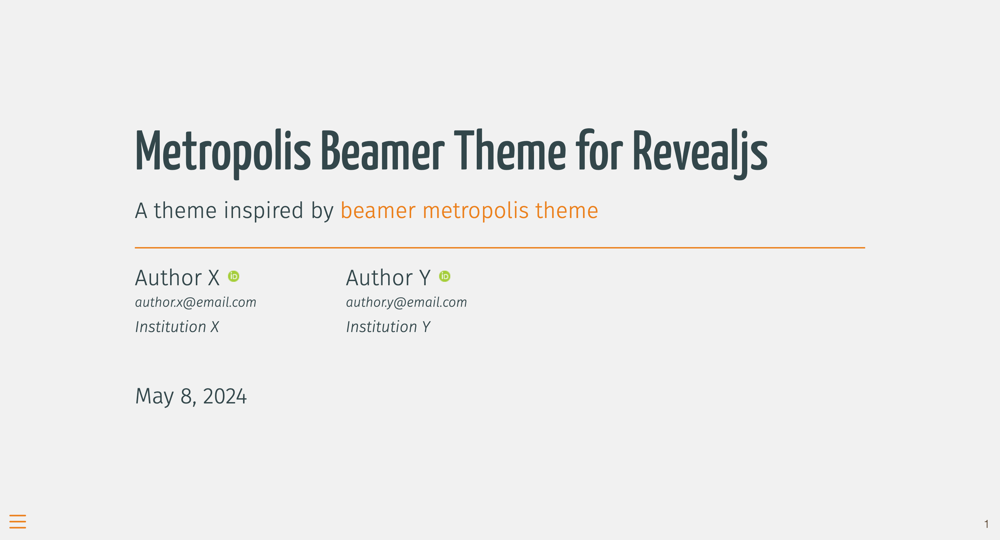
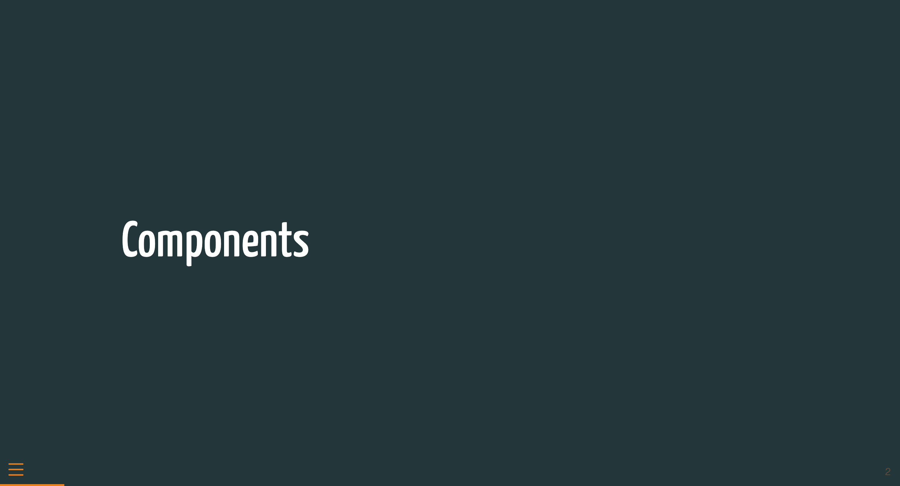
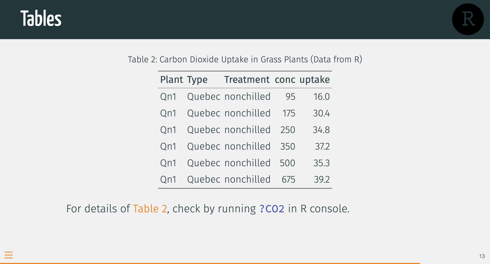
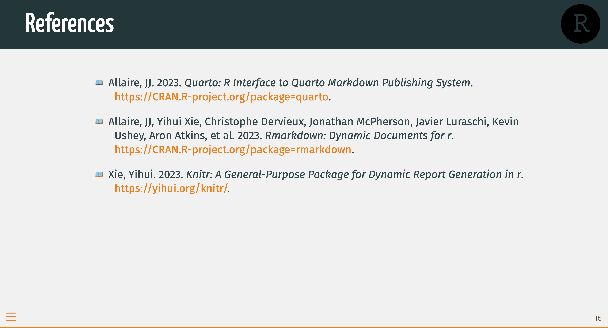
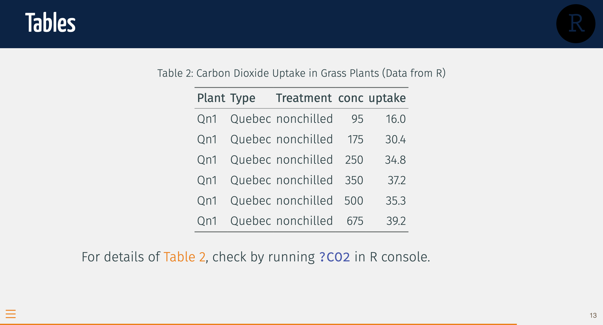
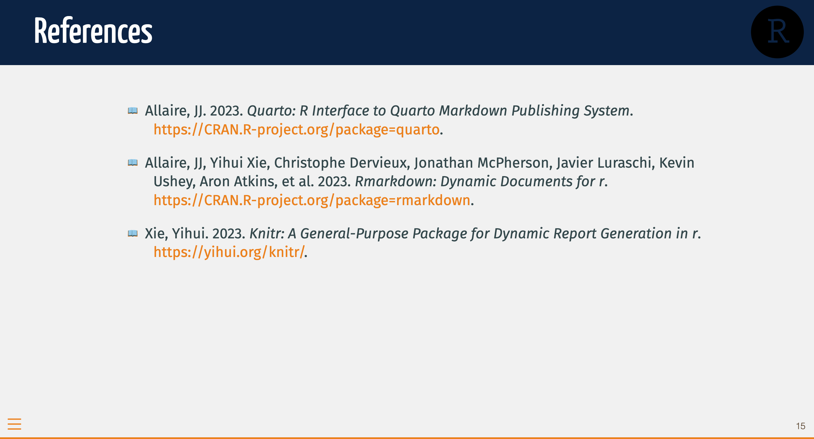

# Beamer Metropolis theme for Revealjs Presentation

This is a Quarto custom format to use a revealjs theme directly inspired by the [Beamer Metropolis theme](https://www.overleaf.com/latex/templates/metropolis-beamer-theme/qzyvdhrntfmr).


<table>
  <tr>
    <td valign="top"></td>
    <td valign="top"></td>
  </tr>
  <tr>
    <td valign="top"></td>
    <td valign="top"></td>
  </tr>
</table>

[`View live demo`](https://shafayetshafee.github.io/metropolis-beamer/template.html)

## Installing

:warning: This extension requires Quarto version to be at least 1.4.

```bash
quarto use template shafayetShafee/metropolis-beamer
```

This will install the extension and create an example qmd file that you can use as a starting place for your article.

## Installing or updating for an existing document

You may also use this format with an existing Quarto project or document. This will install only the files in the `_extension` folder and will not install the files above that (the demo files). This is also how to update the extension if there have been changes.

From the quarto project or document directory, run the following command:

```bash
quarto add shafayetShafee/metropolis-beamer
```

## Using

Simply use the format `metropolis-beamer-revealjs`,

``` yaml
---
format: metropolis-beamer-revealjs
---
```

## Format Options (Optional)

| Options            | Descriptions                                                                  |
|--------------------|-------------------------------------------------------------------------------|
| `header-logo`      | A path for logo image which will appear on the top-left corner of each slide. |
| `header-logo-link` | A web link to linkify the `header-logo`.                                      |


## Customization

It is really easy to customize the outlook of slides using this extension. For example, you can use a different background color for the slide header and compact slides. Just set the color you want to use to `$primary-color` Sass variable in a SCSS file. Then use that file in the `theme` option.

``` scss
/*-- scss:defaults --*/

$primary-color: #0c2344;
```

``` yaml
... other options ...
format: 
  metropolis-beamer-revealjs: 
    theme: style.scss
... other options ...
```

The slides looks like this now,

<table>
  <tr>
    <td valign="top"></td>
    <td valign="top"></td>
  </tr>
  <tr>
    <td valign="top"></td>
    <td valign="top"></td>
  </tr>
</table>


[`View how the slides look now (live)`](https://shafayetshafee.github.io/metropolis-beamer/template-changed-style.html)


| Sass Variables          | Descriptions                                                                      |
|-------------------------|-----------------------------------------------------------------------------------|
| `primary-color`         | Controls the color of header background and slides with H1 header                 |
| `secondary-color`       | Controls the color links, cross-reference, progress line.                         |
| `example-color`         | Controls the color of Example block and Example text.                             |
| `alert-color`           | Controls the color of Alert block and Alert text.                                 |
| `presentation-h-font12` | Controls the presentation title and slide header font (basically H1 and H2 font). |
| `presentation-h-font36` | Controls header of level 3 to 6 (i.e. H3-H6) font.                                |


## Example

Here is the source code for a minimal sample document: [template.qmd](template.qmd).
